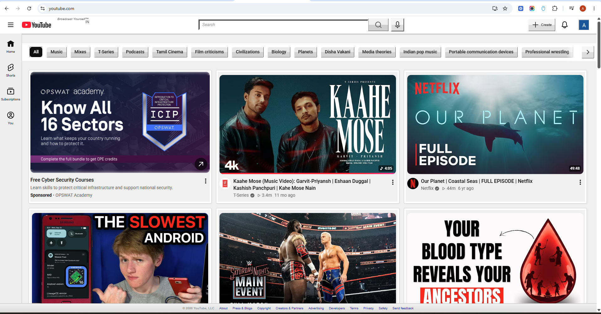

# 📺 Retro YouTube (2008 Edition)

Tired of modern, flat, minimal design? Want to travel back in time to the golden era of the internet?

This Chrome Extension forces modern YouTube into a **2008 Web 2.0 Skeuomorphic** reskin. It uses CSS and JavaScript to strip away the modern UI and bring back the glossy buttons, square avatars, and classic layouts you remember.

### ✨ Features
* **Windows Media Player Vibes:** The video player scrubber bar has been completely redesigned to look like the classic brushed-metal WMP controls.
* **5-Star Ratings:** Re-injects the classic 5-star rating visualizer right below the video title!
* **Chrome-Plated Buttons:** Fully glossy, 50/50 split skeuomorphic gradients on buttons (Subscribe, Search, etc.).
* **Classic UI Touches:** Square 0px border-radius avatars, thin grey panel borders, blue links, and the classic "You Tube" bubble logo.
* **Forum-Style Comments:** Brings back the sharp, distinct bounding boxes for comment threads.

---

## 📸 Screenshots

### The Classic Homepage

### The Video Player & Rating Bar

### The Forum-Style Comments

---

## 🛠️ How to Install (Manual "Unpacked" Method)

Since this extension isn't on the Chrome Web Store yet, you can easily install it manually using Chrome's Developer Mode!

1. **Download the Code:**
   * Click the green **`Code`** button at the top of this GitHub page and select **`Download ZIP`**.
   * Extract the ZIP file to a folder on your computer.

2. **Open Chrome Extensions:**
   * Open Google Chrome and type `chrome://extensions/` in your address bar, then hit Enter.

3. **Enable Developer Mode:**
   * Look for the **"Developer mode"** toggle switch in the top right corner and turn it **ON**.

4. **Load the Extension:**
   * Click the **"Load unpacked"** button that appears in the top left.
   * Select the extracted `Retro-YouTube-Extension` folder you downloaded in Step 1.

5. **Enjoy 2008!**
   * Go to [YouTube](https://www.youtube.com), hard refresh the page (`Ctrl + Shift + R`), and enjoy the nostalgia! 🕹️

---
*Disclaimer: This is a fun project modifying YouTube's CSS/DOM. As YouTube updates their internal classes, some layouts may occasionally break.*
